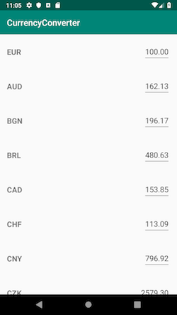

# Currency Converter Repository

## Intro
The main challenge here is to create a list of currencies that update their rates every second from a remote server. The user is allowed to change the base currency, which is on the first position in the list. Whenever the base value is changed, all the other values must change correspondingly with its own rate.

This project considers orientation changes on the device. So I decided to use the MVVM architecture together with Architecture Components, in this way the activity lifecycle is better managed.

To handle the list data I used the concept of [single source of truth](https://developer.android.com/jetpack/docs/guide#persisting_data), where the main source of data is my Room database.

## Screenshot


## Technologies
* Kotlin
* RxJava2
* Dagger2
* Room
* LiveData
* ViewModel
* Retrofit
* Mockito
* JUnit
* Google Truth
* Espresso
* MockWebServer

## Strategy
For me, the biggest challenge to complete this project was to maintain the view state even after the user performs some operations on the list, among the operations the user can perform we have:

* Change the list order with a new base currency, and consequently modifying all other rates.
* Change the base currency value, and consequently modifying all other values.

In meanwhile, all the rates are updated on every second from a server where I cannot control the order of the response's content. The strategy I used is described in the diagram below:


## Recommendations to run
Its recommended to disable the device animations when running the espresso tests.
We can do it on the developer options or just running the ADB commands below:

```
adb shell settings put global window_animation_scale 0
adb shell settings put global transition_animation_scale 0
adb shell settings put global animator_duration_scale 0
```

To make the animations come back to normal, you can run:

```
adb shell settings put global window_animation_scale 1
adb shell settings put global transition_animation_scale 1
adb shell settings put global animator_duration_scale 1
```